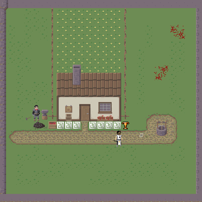

# Demo Game

## Links

  * https://photonstorm.github.io/phaser3-docs/
  * https://phaser.io/phaser3/devlog/134
  * https://opengameart.org/
  * https://www.reddit.com/r/roguelikedev/comments/436sop/roguelike_tilesets/
  * https://itnext.io/modular-game-worlds-in-phaser-3-tilemaps-5-matter-physics-platformer-d14d1f614557
  * https://itnext.io/modular-game-worlds-in-phaser-3-tilemaps-3-procedural-dungeon-3bc19b841cd
  * https://www.deviantart.com/dragondeplatino/art/Repixelled-Dungeon-Mockup-680040192
  * pixeljoint.com
  * https://rexrainbow.github.io/phaser3-rex-notes/
  * https://github.com/jdotrjs/phaser-guides/blob/master/Basics/Part3.md
  * https://github.com/mikewesthad/phaser-3-tilemap-blog-posts/blob/master/examples/post-3/04-dungeon-final/

## Todo
  * Fix mouse click / touch nav
  * Minimap (http://www.html5gamedevs.com/topic/33204-cameras-in-v3/)
  * Implement smaller window and right/left/top/bottom side stats view
  * [x] Fix running speed change after changing locations

## Assets

Assets are based on work of 
https://opengameart.org/users/calciumtrice

